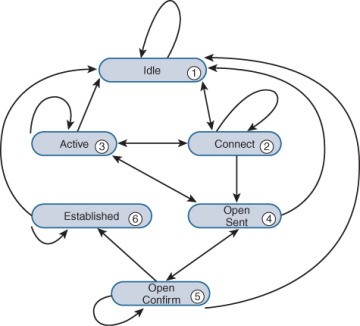
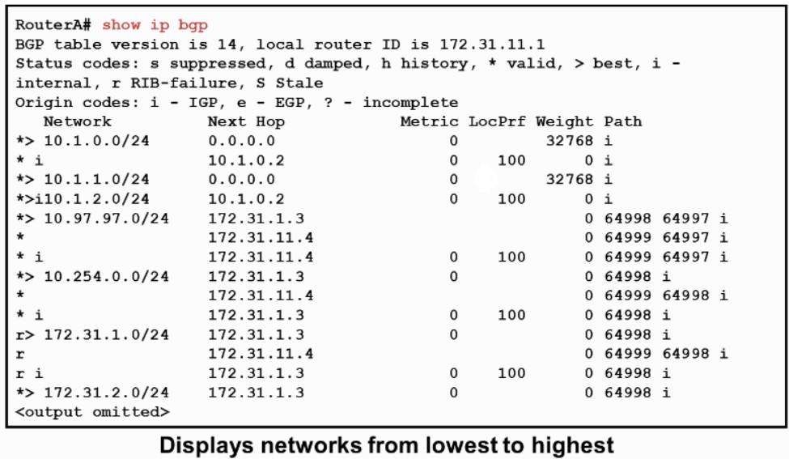

[TOC]

---

# 0. BGP 路由选路原则

- 若 BGP 通过多个渠道获得一条路由条目, 按照以下原则判断路由条目的好坏: 权本自短, 起 ME 近等, 老短低

1. 较高的 **权重 (weight)**;
2. 较高的 **本地优先级 (local preference)**;
3. **本地通告的路由** (IGP 学来的路由)优于邻居传递来的路由(可能产生路由环路);
4. 较短的 **AS-Path**;
5. 较优的 **起源属性 (origin)**: i>e>?;
6. 较小的 **MED** 值;
7. **EBGP 路由** 优于 **联邦 EBGP 路由** 优于 **IBGP 路由**;
8. **下一跳较近的路由**, 即 IGP metric 较小的路由;
9. 若均来自一个 AS 的路由:
    - 启用了 BGP 多路功能, 在路由表中安装等价路由;
    - 未开启 BGP 多路功能, 选择邻居 RID (originator id) 较小的路由;
10. 较老的 **EBGP 路由** (一般不作为参考对象);
11. 较短的 **Cluster List**;
12. **邻居 IP 地址** 较低的路由.

# 1. BGP

- BGP, Border Gateway Protocol, 边界网关协议, 一种可以称之为路径矢量协议的, 在 AS 之间传递路由信息路由协议, 传递消息为路由条目本身.
    - 应用层协议, TCP 179 端口, 更新报文均为单播报文.
    - 管理距离: IBGP 为 200; EBGP 为 20.
- AS (Autonomous System, 自治系统), 唯一的标记一个园区网(或者自定义区间), 其范围为 0-65535. 其中 0-64511 为公有 AS 号, 64512-65535 为私有号.
- 防环机制:
    - IBGP: 收到 IBGP 对等体的路由不会再传给其他 IBGP 对等体
    - EBGP: 通过 AS path 属性, 不会将路由传给已包含的 AS 内的路由器
- 同步概念: 如果路由器通过 IBGP 学到一条路由, 该路由器必须再通过 IGP 学到该路由才可以加表.

# 2. BGP 报文类型

- [BGP报文类型](https://cshihong.github.io/2018/01/23/BGP%E6%8A%A5%E6%96%87%E7%B1%BB%E5%9E%8B/)
    - **Open**: 用于交互邻居路由器信息, 建立邻接关系;
    - **Keepalive**: 用于维护邻接关系, 默认每 60s 发送一次;
    - **Update**: 用于交互路由、掩码等属性信息, 也有用路由的撤销;
    - **Notification**: 用于处理 BGP 进程中的各种错误;
    - **Refresh**: 报文用于动态的请求 BGP 路由发布者重新发布 UPDATE 报文, 进行路由更新.

# 3. BGP 邻居状态



- BGP 邻居状态转化过程
    - 1(Idle) -> 2(Connect): 进行 TCP 三次握手
    - 2(Connect) -> 4(OpenSent): TCP 三次握手成功, ConnectRetryTimer 置位后发送 Open 报文
    - 4(OpenSent) -> 5(OpenConfirm): Open 报文信息一致, 然后发送 Keepalive 报文
        - 协商的信息包括: BGP版本, AS号, Holdtime(默认 180s)和 RID.
        - RID 可以手动配置, 也可以自动选举, 其规则和 OSPF 一致:
            - 选择在线环回口最大的 IP 地址作为 RID;
            - 选择物理口最大的 IP 地址作为 RID.
    - 5(OpenConfirm) -> 6(Established): 收到 Keepalive 或者 Notification 报文, 开始传递路由.
    - 2(Connect) -> 3(Active): ConnectRetryTimer 超时, 重置 ConnectRetryTimer (TCP 建立失败)
    - 3(Active) -> 2(Connect): 新的 TCP 连接失败
    - 3(Active) -> 4(OpenSent): 新的 TCP 连接成功, 并且新的 Open 报文发送
    - 4(OpenSent) -> 3(Active): 收到 TCP 失联消息

# 4. BGP 属性

## 4.0 属性分类

| 属性类型 | 举例 |
| -- | -- |
| 公认强制属性 (Well-known mandatory) | AS_PATH, Origin, NEXT_HOP |
| 公认自选属性 (Well-known discretionary) | Local Preference, Atomic_Aggregate |
| 可选传递属性 (Optional transtive) | Aggregator, Community |
| 可选非传递属性 (Optional non-transtive) | Weight, MED, ORIGINATOR_ID, CLUSTER_ID |

## 4.1 Weight

| Weight | 权重 |
| -- | -- |
| 说明 | - |
| 分类 | 可选非传递属性/思科私有属性 |
| 传递性 | 不可传递 |
| 数据类型 | 0 ~ 2^16-1 |
| 比较方式 | 越大越优 |
| 默认值 | 下一跳为 0.0.0.0, 则为 32768; 否则为 0 |

- 配置举例: 指定邻居修改
```
neighbor 3.3.3.3 weight 1
```

- 配置举例, 精确修改, 调用route-map
```
ip prefix-list wei_plist seq 5 permit 11.11.11.0/24
route-map wei_map permit 10
 match ip address prefix-list wei_plist
 set weight 1
route-map wei_map permit 20
router bgp 234
 nei 3.3.3.3 route-map wei_map in
```

## 4.2 Local Preference

| Local Preference | 本地优先级 |
| -- | -- |
| 说明 | - |
| 分类 | 公认自选属性 |
| 传递性 | 一个 AS 内 |
| 数据类型 | 0 ~ 2^32-1 |
| 比较方式 | 越大越优 |
| 默认值 |  100 |

- 配置举例: 全局修改
```
bgp default local-preference 101
```

- 配置举例: 精确修改:
```
ip prefix-list 10 seq 10 permit 111.111.111.0/24
route-map local permit 10
 match ip address prefix-list 10
 set local-preference 101
route-map local permit 20
router bgp 234
 neighbor 12.1.1.1 route-map local in
```

## 4.3 AS_PATH

| AS_PATH | AS 路径 |
| -- | -- |
| 说明 | 路由传递所经过的 AS 路径 |
| 分类 | 公认强制属性 |
| 传递性 | 整个 Internet |
| 数据类型 | [AS...] |
| 比较方式 | 越短越优 |
| 默认值 | - |

- 配置举例:
```
access-list 10 permit 11.11.11.0
route-map ap1 permit 10
 match ip address 10
 set as-path prepend 5 6 7 8        #可以添加相同的as
route-map ap1 permit 20
router bgp 234
 neighbor 12.1.1.1 route-map ap1 in
 neighbor 4.4.4.4 allowas-in         #允许向已有的AS-Path传递路由
 bgp maxas-limit 10                  #允许最大传输的AS-Path数为10
 bgp bestpath as-path ignore         #忽略AS-path属性
```

### 4.3.1 Confederation

- 联邦属性: 考虑到 BGP 的防环机制, iBGP 之间传递路由只能有一跳; 在一个 AS 之内, 逻辑划分出多个子(联邦) AS 建立 EBGP 邻接关系, 可将母 AS 之内进行多跳的传递.

- 在 AS-path 属性中, 以 AS_CONFED_SEQUENCE 字段标明.

- 联邦属性只能在一个联邦母 AS 内进行传递

- **EBGP 路由** 优于 **联邦 EBGP 路由** 优于 **IBGP 路由**

- 配置举例
```
        +--------+   +------------------------------------------+
        |        |   | +------------------+    +--------------+ |
        | +----+ |   | | +----+    +----+ |    |    +----+    | |
        | | R1 |-|---|-|-| R2 |----| R3 |-|----|----| R4 |    | |
        | +----+ |   | | +----+    +----+ |    |    +----+    | |
        |        |   | |   Sub AS 65002   |    | Sub AS 65004 | |
        |        |   | +------------------+    +--------------+ |
        |  AS 1  |   |                   AS 2                   |
        +--------+   +------------------------------------------+

R1:
router bgp 1
 network 1.1.1.1 mask 255.255.255.255
 neighbor 12.1.1.2 remote-as 2
R2:
router bgp 65002                            # 宣告子AS号
 bgp router-id 2.2.2.2
 bgp confederation identifier 2             # 宣告主AS号
 neighbor 12.1.1.1 remote-as 1
 neighbor 23.1.1.3 remote-as 65002          # 使用子AS号指定邻居
R3:
router bgp 65002
 bgp router-id 3.3.3.3
 bgp confederation identifier 2
 bgp confederation peers 65004
 neighbor 23.1.1.2 remote-as 65002
 neighbor 34.1.1.4 remote-as 65004
R4:
router bgp 65004
 bgp router-id 4.4.4.4
 bgp confederation identifier 2
 bgp confederation peers 65002
 neighbor 34.1.1.3 remote-as 65002
```

## 4.4 Origin

| Origin | 起源 |
| -- | -- |
| 说明 | 描述路由以何种方式进入 BGP; `i` 为 IGP 宣告进入, `?` 为重分发进入, `e` 为通过 EGP(为BGP的前身公认强制属性) 进入 |
| 分类 | 公认强制属性 |
| 传递性 | 整个 Internet |
| 数据类型 | `i/e/?` |
| 比较方式 | `i` 优于 `e` 优于 `?` |
| 默认值 | - |

- 配置举例:
```
ip prefix-list 10 per 11.11.11.0/24
route-map o per 10
 match ip add prefix-list 10
 set origin incomplete
route-map o per 20
router bgp 234
 neighbor 4.4.4.4 route-map o out
```

## 4.5 MED

| MED | 多出口鉴别器 |
| -- | -- |
| 说明 | Multi-Exit Discriminators, 通告给邻居 AS, 告知流量如何进入本 AS |
| 分类 | 可选非传递属性 |
| 传递性 | 邻居 AS |
| 数据类型 | 0 ~ 2^32-1 |
| 比较方式 | 越小越优 |
| 默认值 | IETF 定义为最大值, Cisco 定义为 0 |

- 配置举例:
```
ip prefix-list 10 seq 5 permit 11.11.11.0/24 # 将本地路由通告给邻居AS
route-map m permit 10
 match ip address prefix-list 10
 set metric 100
route-map m permit 20
router bgp 1
 neighbor 13.1.1.3 route-map m out
bgp bestpath med missing-as-worst   # 将思科路由器缺省值改为最大值
bgp always-compare-med              # 允许不同路由器发送来的同一条路由条目来比较其MED值
```

## 4.6 NEXT_HOP

| NEXT_HOP | 下一跳 |
| -- | -- |
| 说明 | - |
| 分类 | 公认强制属性 |
| 传递性 | 整个 Internet |
| 数据类型 | IP addr |
| 比较方式 | 越小越优 |
| 默认值 | - |

- 路由下一跳的值说明
    - 本地通告，如果路由类型为
        - 直连或者静态, 下一跳为 0.0.0.0
        - 通过 IGP 学到的, 下一跳为 IGP 的下一跳地址
    - 通过 BGP 对等体学习到的路由, 下一跳为邻居更新源地址
    - 通过 EBGP 学习到的路由, 又更新给了 IBGP 时, 默认情况下下一跳不变; (除非 next-hop-self, 或者其 IBGP 对等体有本地关于 EBGP 的更新源地址路由)

## 4.7 ORIGINATOR_ID & CLUSTER_LIST

| ORIGINATOR_ID | 通告者 Router ID |
| -- | -- |
| 说明 | 路由器反射器对于路由通告者的标识 |
| 分类 | 可选非传递属性 |
| 传递性 | 一个 RR 域 |
| 数据类型 | IP addr |
| 比较方式 | 越小越优 |
| 默认值 | - |

| CLUSTER_LIST | 途径 RR 组的 List |
| -- | -- |
| 说明 | 用于标识一组 RR |
| 分类 | 可选非传递属性 |
| 传递性 |  一个 AS 内 |
| 数据类型 | [IP addr...] |
| 比较方式 | 越短越优 |
| 默认值 | - |

### 4.7.1 Router Reflector 机制

- 名词解释
    - RR: 路由反射器
    - Cluster, 在同一个AS之内, RR所能涉及到的范围;
    - RRC, 路由反射器客户端.

- 工作机制
    - RR 和 RRC 之间有 IBGP 邻接关系, 而 RRC 之间没有邻接关系.
    - RR 收到一条 EBGP 路由, 会将其传递给其它 EBGP/IBGP 对等体(包括 RRC 和 non-RRC);
    - RR 收到一条 RRC 传递的 IBGP 路由, 会将其发送给其他 EBGP/IBGP 对等体(包括 RRC 和 non-RRC);
    - RR 收到一条 non-RRC 传递的 IBGP 路由, 会将其传递给其他 EBGP 对等体和 RRC, 不会传递给non-RRC.
    - 被RR反射的路由, 不会修改任何BGP属性.

- 配置: 在RR上BGP进程中配置: `neighbor 23.1.1.3 route-reflector-client`, 宣告23.1.1.3为本地的RRC

## 4.8 Atomic_Aggregate & Aggregator

| Atomic_Aggregate | 聚合后的路由 |
| -- | -- |
| 说明 | 聚合后的路由 |
| 分类 | 公认自选属性 |
| 传递性 | 整个Internet |
| 数据类型 | [IP addr...] |

| Aggregator | 聚合路由器 |
| -- | -- |
| 说明 | 聚合路由是谁聚合的 |
| 分类 | 可选传递属性 |
| 传递性 | 整个Internet |
| 数据类型 | [IP addr...] |

- 路由的两种聚合方式
    - 手动写一条精确聚合路由, 指向 null0, 然后将其宣告进入 BGP;
    - 使用 network 命令先宣告至少一条精确路由, 然后使用 `aggregate-address 192.168.4.0 255.255.252.0` 宣告聚合路由. 此时 BGP 会将聚合路由和明细路由同时传递, 使用命令 `aggregate-address 192.168.4.0 255.255.252.0 summary-only` 可以抑制明细路由, 也可以使用 `suppress-map` 来精确抑制.

- 在传递聚合路由时, 使用`summary-only`参数会导致AS-PATH属性丢失的情况, 所以在传递聚合路由时, 可以加入atomic aggregate属性来标识该路由为聚合路由.

- 配置方法

```
aggregate-address 192.168.4.0 255.255.252.0 as-set summary-only      # 显式原来所在的AS Path
```

## 4.9 (Extended) Community

| Community | 团体 |
| -- | -- |
| 说明 | - |
| 分类 | 可选传递属性 |
| 传递性 | 只能传递一跳 |

- 标准团体属性
    - No-Advertise: 收到携带该属性的 BGP 路由时, 路由无法传递给其他 BGP 对等体;
    - No-Export: 收到携带该属性的 BGP 路由时, 路由无法传递给其他 EBGP 对等体, 只能在一个 AS 内传递. 但若在联邦中, 该属性可以在子 AS 之间进行传递;
    - Local-AS: 收到携带该属性的 BGP 路由时, 路由只能在本地 AS 内传递, 包括在联邦的子 AS 内传递.

- 扩展团体属性: `XX: YY tag`, 可以使用该tag来过滤路由.

- 配置命令: 
```
ip community-list standard DENY permit 50:50
route-map COM deny 10
  match community DENY
route-map COM per 20
router bgp 65001
  nei 1.1.1.1 route-map COM in
```

# 5. show ip bgp命令



- BGP表中, 从左到右
    - `*`为合法路由, 有资格加入路由表;
    - r为RIB-failure路由, 也有资格加表, 但由于管理距离, 无法加表;
    - s为抑制路由;
    - `>`为最优路由, 实际加入路由表中的路由;
    - i为路由通过ibgp学到的; 后面的i标识起源属性, 意为通过igp进入BGP的.

# 6. 一些命令
- BGP进程下: 
    - `neighbor IP-ADD shutdown`, 用来将BGP邻居down
    - `neighbor IP-ADD update-source INTERFACE`, 修改更新源地址
    - `neighbor IP-ADD ebgp-multihop TTL-VALUE`, 修改 EBGP 建立邻居的 TTL 值, 默认为 1.
    - `neighbor IP-ADD next-hop-self`, BGP 对于 IBGP 邻居传递路由时, 其下一条地址不变, 配置该命令会将下一条指向自己.
    - `neighbor IP-ADD password PASSWORD`
    - `neighbor IP-ADD soft-reconfiguration inbound` 允许sh ip bgp neighbors IP-ADD received-routes
    - `clear ip bgp * soft in/out` 软清除BGP邻接关系, 重新发一次路由更新
    - `clear ip bgp *` 硬重置BGP邻接关系, 使BGP重新进行三次握手
    - `show ip bgp summary` 查看邻居状态等信息
